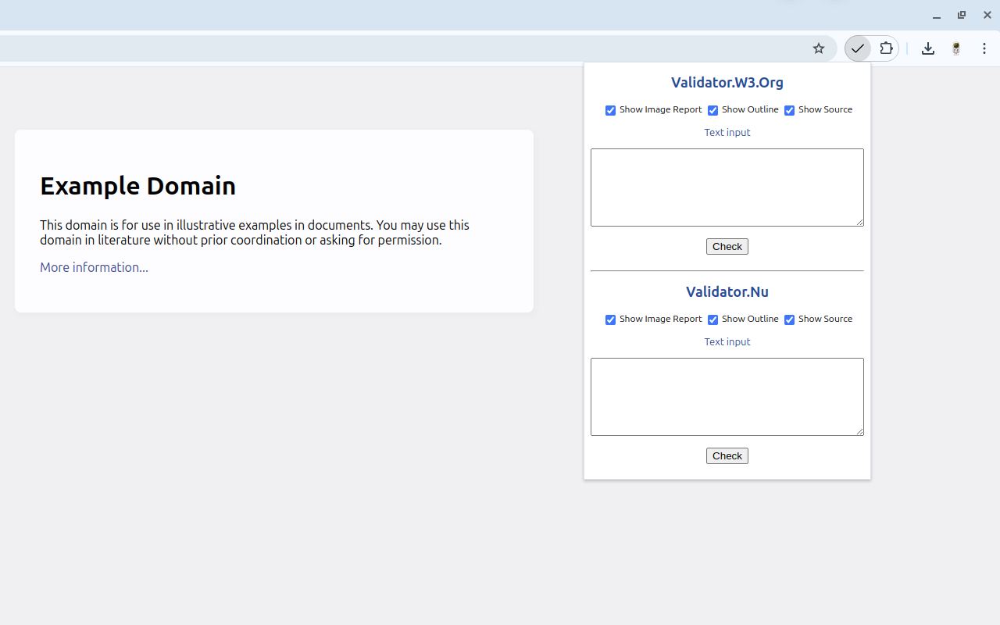

# [Markup Validator](https://chromewebstore.google.com/detail/fkkaidikdiekajbmmpiggofmjcgajegl)

- [Chrome Web Store](https://chromewebstore.google.com/detail/fkkaidikdiekajbmmpiggofmjcgajegl)
- [Installation for developers (for Linux users)](#installation-for-developers-for-linux-users)
- [Sources](#sources)
    - [Icons](#icons)

---

---

## Installation for developers (for Linux users)

1. Go to the `chrome://extensions`.
2. Enable `Developer mode` checkbox.
3. Click on the `Load unpacked` button.
4. Select the extension directory.

---

## Sources

### Icons

- [Checked](https://www.flaticon.com/free-icon/checked_130878)
